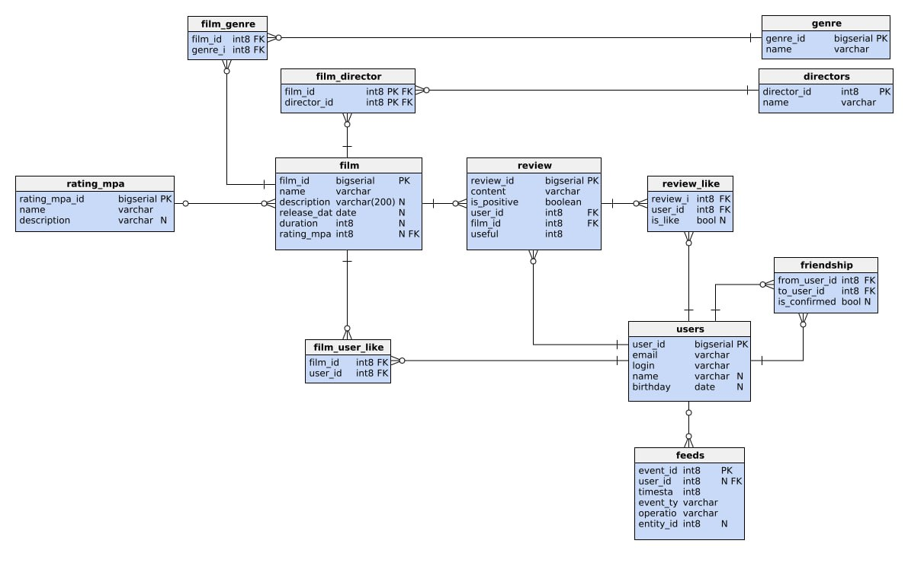

# Filmorate

## Назначение

Filmorate — это приложение аналог кинопоиска:)

## ER-диаграмма базы данных



## Описание схемы

На данной диаграмме представлены следующие таблицы:

- **directors**
  Содержит информацию о режиссерах фильмов.
  Поля:
    - `director_id` — идентификатор режиссера (первичный ключ)
    - `name` — имя режиссера

### Пример запроса:

```sql
INSERT INTO directors (name) VALUES ('Кристофер Нолан');
SELECT * FROM directors;
```

- **rating_mpa**
  Содержит информацию о рейтинге MPA.
  Поля:
    - `rating_mpa_id` — идентификатор рейтинга (первичный ключ)
    - `name` — название рейтинга
    - `description` — описание рейтинга

### Пример запроса:

```sql
INSERT INTO rating_mpa (rating_mpa_id, name, description)
VALUES (1, 'PG-13', 'Рекомендуется присмотр родителей для детей младше 13 лет');
SELECT * FROM rating_mpa;
```

- **film**
  Содержит информацию о фильмах.
  Поля:
    - `film_id` — идентификатор фильма (первичный ключ)
    - `name` — название фильма
    - `description` — описание фильма
    - `release_date` — дата выхода фильма
    - `duration` — длительность фильма
    - `rating_mpa_id` — внешний ключ на таблицу `rating_mpa`

### Пример запроса:

```sql
INSERT INTO film (name, description, release_date, duration, rating_mpa_id)
VALUES ('Начало', 'Фантастический триллер', '2010-07-16', 148, 1);
SELECT * FROM film;
```

- **film_director**
  Содержит информацию о связях между фильмами и режиссерами.
  Поля:
    - `film_id` — идентификатор фильма (внешний ключ)
    - `director_id` — идентификатор режиссера (внешний ключ)

### Пример запроса:

```sql
INSERT INTO film_director (film_id, director_id) VALUES (1, 1);
SELECT * FROM film_director;
```

- **users**
  Содержит информацию о пользователях.
  Поля:
    - `user_id` — идентификатор пользователя (первичный ключ)
    - `email` — email пользователя
    - `login` — логин пользователя
    - `name` — имя пользователя
    - `birthday` — день рождения пользователя

### Пример запроса:

```sql
INSERT INTO users (email, login, name, birthday)
VALUES ('test@example.com', 'testuser', 'Тестовый Пользователь', '1990-01-01');
SELECT * FROM users;
```

- **genre**
  Содержит информацию о жанрах фильмов.
  Поля:
    - `genre_id` — идентификатор жанра (первичный ключ)
    - `name` — наименование жанра

### Пример запроса:

```sql
INSERT INTO genre (name) VALUES ('Драма');
SELECT * FROM genre;
```

- **film_genre**
  Содержит связи между фильмами и жанрами.
  Поля:
    - `film_id` — идентификатор фильма (внешний ключ)
    - `genre_id` — идентификатор жанра (внешний ключ)

### Пример запроса:

```sql
INSERT INTO film_genre (film_id, genre_id) VALUES (1, 1);
SELECT * FROM film_genre;
```

- **friendship**
  Содержит информацию о дружбе между пользователями.
  Поля:
    - `from_user_id` — идентификатор пользователя, отправившего запрос (внешний ключ)
    - `to_user_id` — идентификатор пользователя, получившего запрос (внешний ключ)
    - `is_confirmed` — статус подтверждения дружбы

### Пример запроса:

```sql
INSERT INTO friendship (from_user_id, to_user_id, is_confirmed)
VALUES (1, 2, true);
SELECT * FROM friendship;
```

- **film_user_like**
  Содержит информацию о лайках фильмов пользователями.
  Поля:
    - `film_id` — идентификатор фильма (внешний ключ)
    - `user_id` — идентификатор пользователя (внешний ключ)

### Пример запроса:

```sql
INSERT INTO film_user_like (film_id, user_id) VALUES (1, 1);
SELECT * FROM film_user_like;
```

- **review**
  Содержит отзывы пользователей на фильмы.
  Поля:
    - `review_id` — идентификатор отзыва (первичный ключ)
    - `content` — текст отзыва
    - `is_positive` — положительный ли отзыв
    - `user_id` — идентификатор пользователя, оставившего отзыв (внешний ключ)
    - `film_id` — идентификатор фильма (внешний ключ)
    - `useful` — полезность отзыва

### Пример запроса:

```sql
INSERT INTO review (content, is_positive, user_id, film_id, useful)
VALUES ('Отличный фильм!', true, 1, 1, 15);
SELECT * FROM review;
```

- **review_like**
  Содержит информацию о лайках отзывов.
  Поля:
    - `review_id` — идентификатор отзыва (внешний ключ)
    - `user_id` — идентификатор пользователя, поставившего лайк (внешний ключ)
    - `is_like` — является ли это лайком (true/false)

### Пример запроса:

```sql
INSERT INTO review_like (review_id, user_id, is_like) VALUES (1, 1, true);
SELECT * FROM review_like;
```

- **feeds**
  Содержит ленту событий для пользователей.
  Поля:
    - `event_id` — уникальный идентификатор события (первичный ключ)
    - `user_id` — идентификатор пользователя, связанного с событием (внешний ключ)
    - `timestamp` — временная метка события
    - `event_type` — тип события (например, "LIKE", "REVIEW", "FRIENDSHIP")
    - `operation` — операция, связанная с событием (например, "ADD", "REMOVE", "UPDATE")
    - `entity_id` — идентификатор сущности, связанной с событием (например, фильм, отзыв)

### Пример запроса:

```sql
INSERT INTO feeds (user_id, entity_id, event_type, operation, timestamp)
VALUES (1, 1, 'LIKE', 'ADD', 1672531200);
SELECT * FROM feeds;
```

## Примеры сложных запросов

### Получение всех отзывов с сортировкой по полезности:

```sql
SELECT content, useful
FROM review
ORDER BY useful DESC;
```

### Получение фильмов определенного режиссера:

```sql
SELECT f.name
FROM film f
JOIN film_director fd ON f.film_id = fd.film_id
WHERE fd.director_id = 1;
```

### Получение популярных фильмов (ТОП-10):

```sql
SELECT f.name, COUNT(ful.user_id) AS likes
FROM film f
LEFT JOIN film_user_like ful ON f.film_id = ful.film_id
GROUP BY f.film_id
ORDER BY likes DESC
LIMIT 10;
```

### Получение подтвержденных друзей пользователя:

```sql
SELECT u.user_id, u.name
FROM friendship f
JOIN users u ON f.to_user_id = u.user_id
WHERE f.from_user_id = 1 AND f.is_confirmed = true;
```
